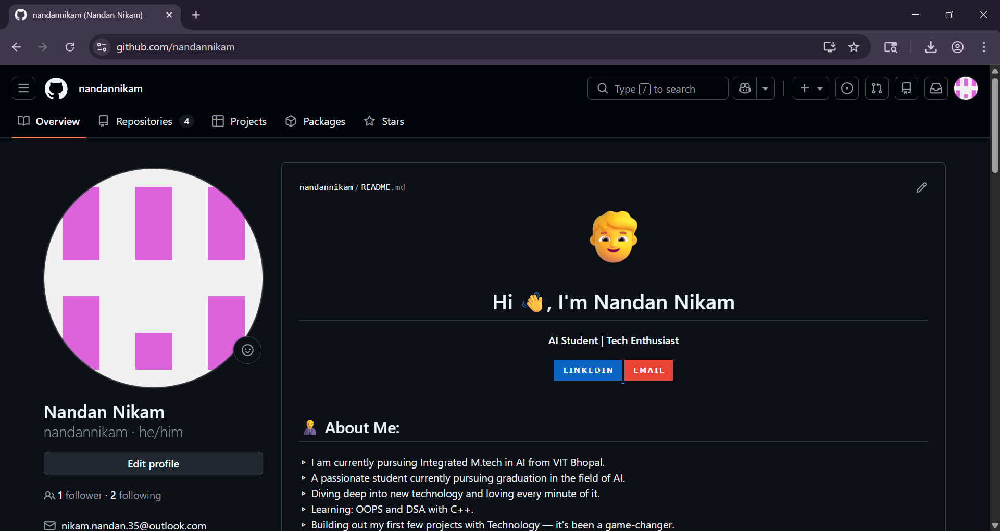
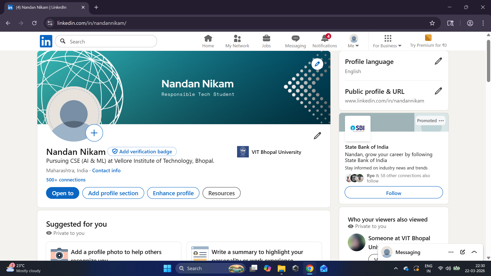
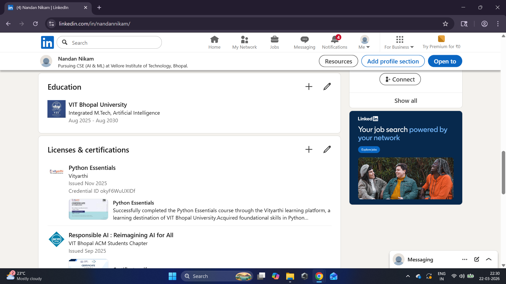
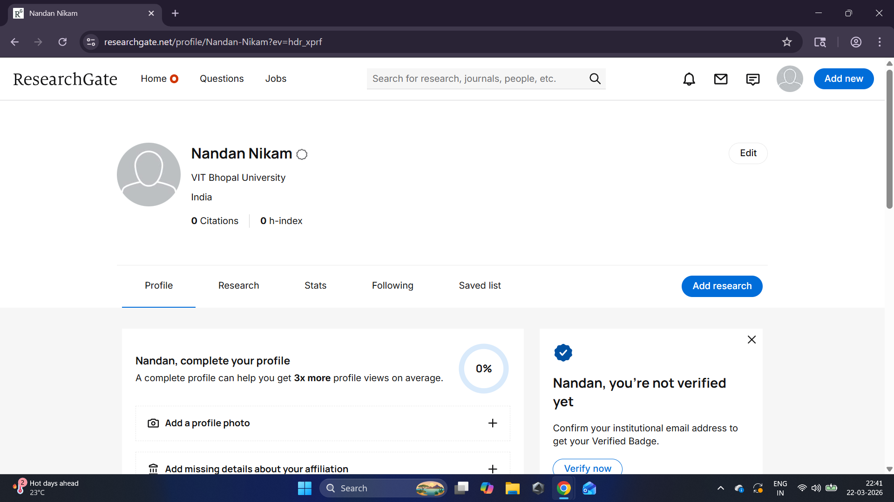

## GitHub Profile

## LinkedIn Profile

## ResearchGate Profile

## Reflection Notes

For this task, I choose to create my profiles on GitHub, LinkedIn, and ResearchGate. I selected these three because they are one of the most important and professional digital platforms for coding, networking, and academic research respectively.

GitHub is where I host my projects and show my coding progress by keeping record on the changes I commit. It acts record of work for my future.

LinkedIn is like my professional identity. It is the platform where I connect with mentors, peers, and other experienced people of my field and also companies and HR's can see my record of my education and skill and work history.

ResearchGate is focused on the academic side, which allowes me to read various scientific papers and eventually afterwards share my own research papers.

Over the next four years, I plan to use these platforms as a "living resume." On GitHub, I will consistently push code from my college projects and personal projects to build a strong commit record. On LinkedIn, I plan to post updates about certifications I earn and internships I complete. Finally, I will use ResearchGate to stay updated on the latest trends in my field of carrer. By maintaining these regularly, I will be well-prepared for the job market or higher studies by the time I graduate.
