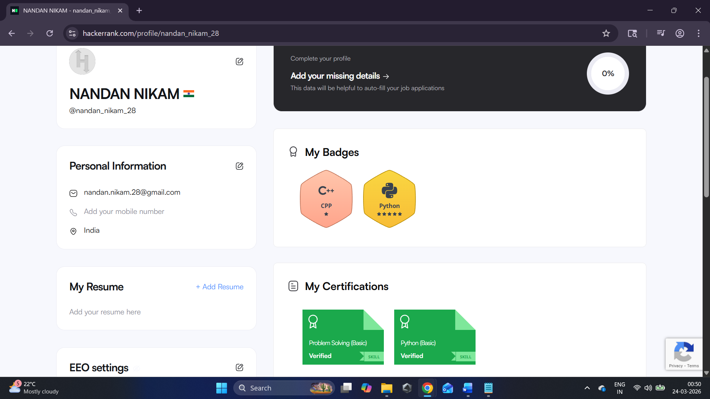
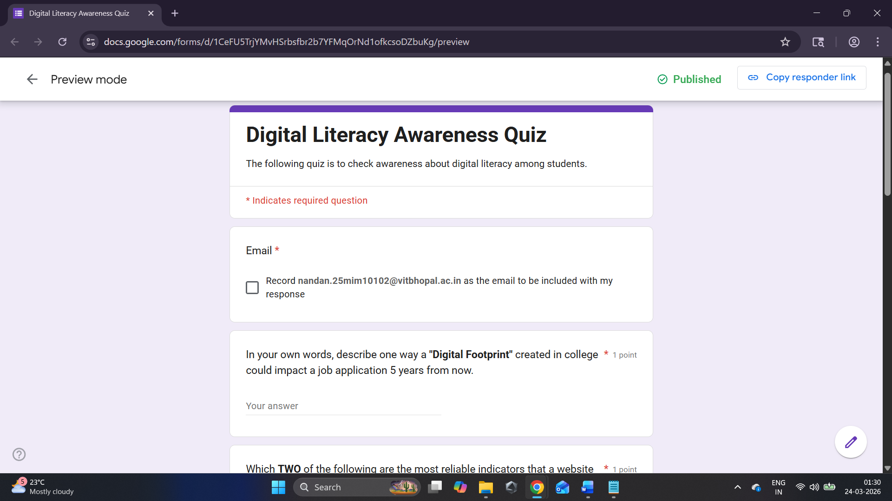
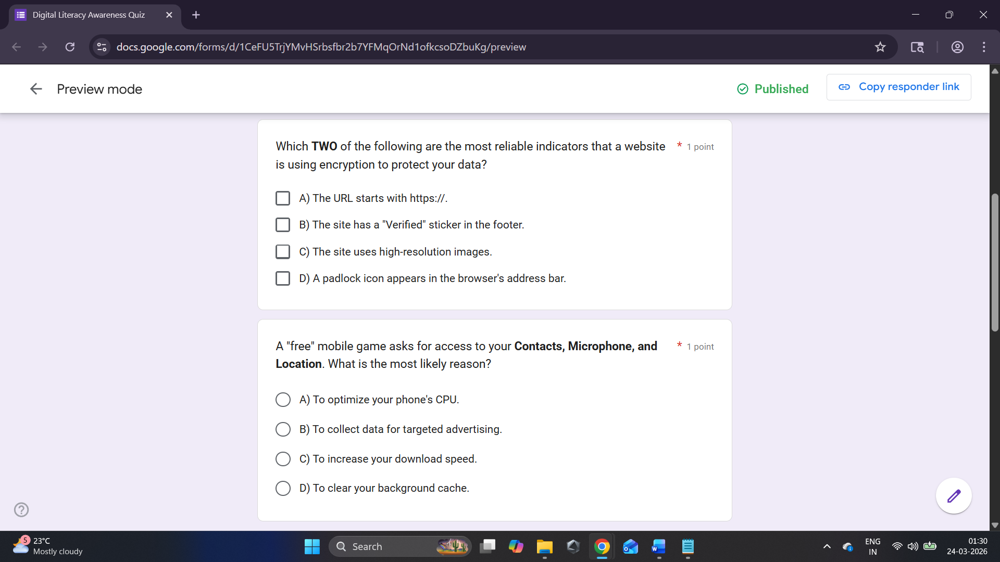
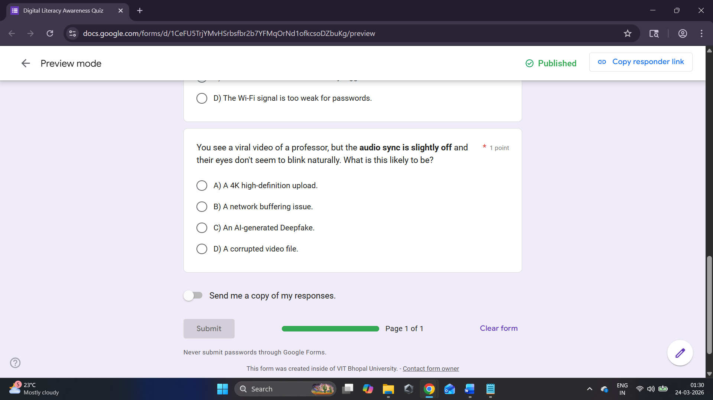
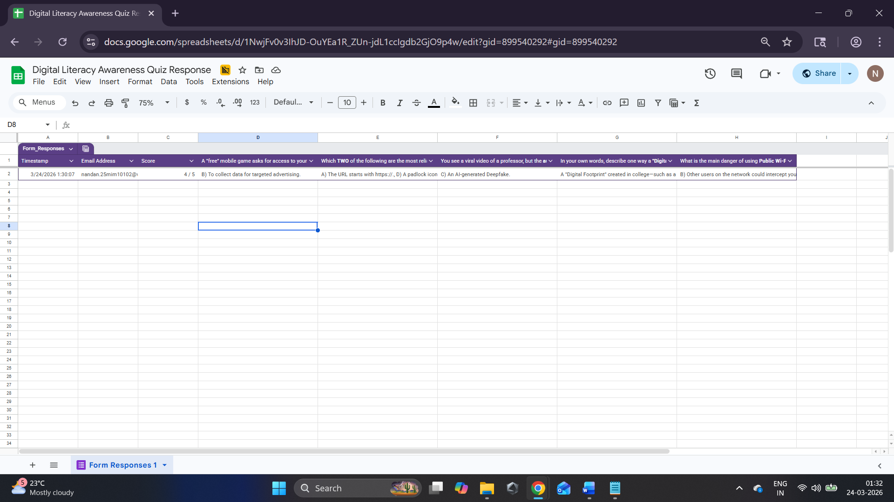

## HackerRank Profile

## Google Form

Google Form Link - https://forms.gle/PUvQKs76uJhtBUy47
 
Google Sheet Link - https://docs.google.com/spreadsheets/d/1NwjFv0v3IhJD-OuYEa1R_ZUn-jdL1ccIgdb2GjO9p4w/edit?usp=sharing

#### Google Form Screenshots

#### Google Sheet Screenshots

## Notes

Through this activity, I have learn and practiced to make Google Forms and also how to get there responses in Google Sheets.
I have also learned that how to solve coding competitive problems on online platforms like HackerRank.
